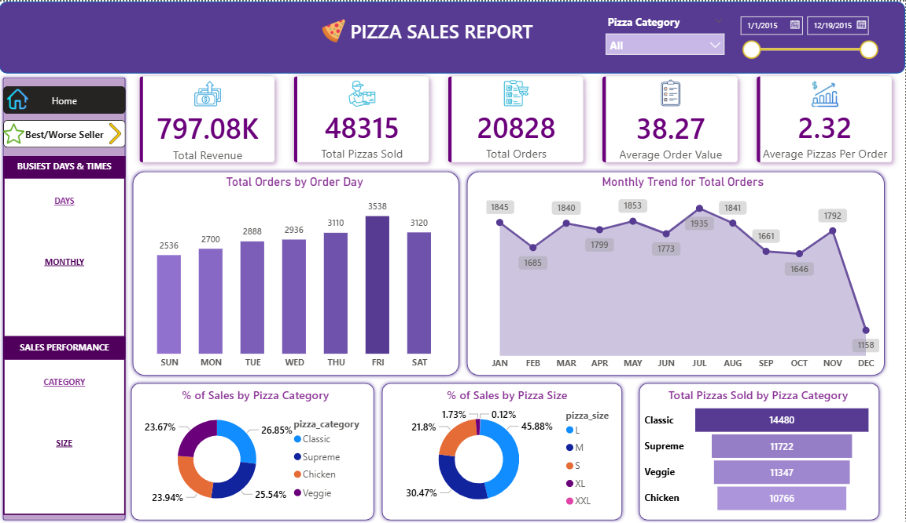
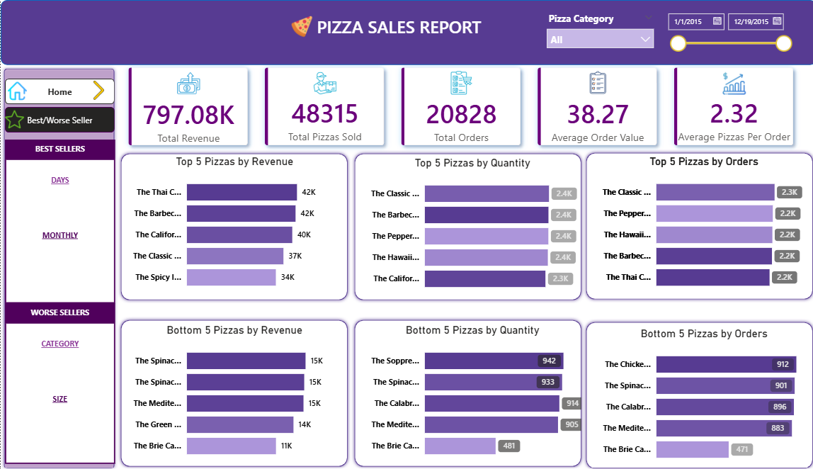
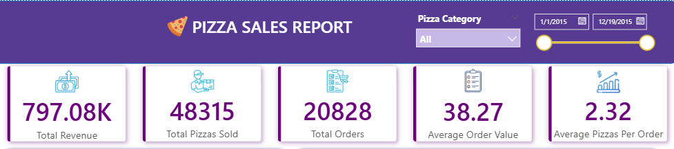
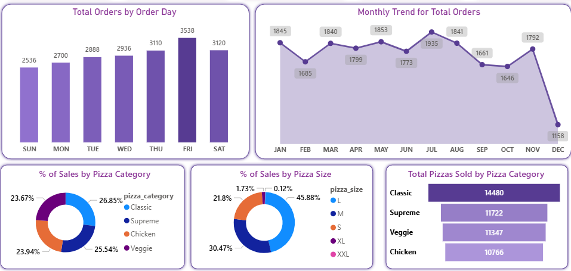
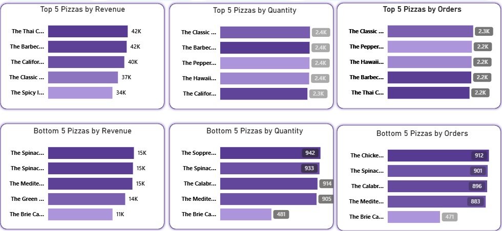

# 🍕 Pizza Sales Analysis (SQL + Power BI)

## 📌 Project Overview
This project presents an end-to-end Pizza Sales Analysis using SQL for data extraction and transformation and Power BI for interactive dashboard visualization.

The dashboard provides insights into sales performance, customer behavior, and product trends, enabling better business decisions.

---

## 🎯 Business Problem
The business wants to understand:
- How sales are performing over time  
- Which pizzas are best and worst sellers  
- Customer ordering patterns  
- Contribution of different categories and sizes to revenue  

---

## 🎯 Objectives
- Analyze overall sales performance  
- Track order trends (daily, monthly, hourly)  
- Identify top-performing and underperforming products  
- Understand revenue contribution by category and size  
- Provide actionable insights for business growth  

---

## 🛠 Tools & Technologies
- SQL – Data analysis and KPI calculations  
- Power BI – Dashboard creation and visualization  
- Excel/CSV – Dataset storage  

---

## 📊 Key Performance Indicators (KPIs)

- 💰 Total Revenue  
- 📦 Total Orders  
- 🍕 Total Pizzas Sold  
- 📈 Average Order Value  
- 📊 Average Pizzas per Order  

---

## 🧮 SQL Analysis

### 🔹 KPI Queries
- Total Revenue → SUM(total_price)  
- Average Order Value → SUM(total_price) / COUNT(DISTINCT order_id)  
- Total Orders → COUNT(DISTINCT order_id)  
- Total Quantity Sold → SUM(quantity)  
- Avg Pizzas per Order → SUM(quantity) / COUNT(DISTINCT order_id)  

### 🔹 Trend Analysis
- Daily order trends  
- Monthly order trends  
- Hourly sales patterns  

### 🔹 Sales Distribution
- Percentage of sales by pizza category  
- Percentage of sales by pizza size  

### 🔹 Product Performance
- Top 5 best-selling pizzas  
- Top 5 worst-selling pizzas  

---

## 📈 Dashboard Features

### 📅 Time-Based Insights
- Daily trends of total orders  
- Monthly order patterns  
- Hourly peak sales analysis  

### 🍕 Product Analysis
- Sales by pizza category  
- Sales by pizza size  
- Best and worst-performing pizzas  

### 📊 Visualizations Used
- Line Chart (Trends)  
- Bar Chart (Comparison)  
- Pie/Donut Chart (Distribution)  
- KPI Cards (Key metrics)  

---

## 📸 Screenshots

### 🔹 Dashboard Overview

### 🔹 Best vs Worse Seller

### 🔹 Kpis

### 🔹 Product Insights

### 🔹 Product Insights

---

## 💡 Key Insights

- Peak sales occur during specific hours, indicating high-demand time slots  
- A few pizza categories contribute the majority of total revenue  
- Large-size pizzas generate higher revenue share  
- Top 5 pizzas significantly outperform others (high demand items)  
- Low-performing pizzas can be optimized or removed from the menu  
- Sales trends show consistent patterns across days and months  

---

## 🚀 Business Impact
- Helps optimize menu offerings  
- Improves inventory planning  
- Supports targeted promotions during peak hours  
- Enables data-driven decision-making  

---

## 📂 Project Structure

pizza-sales-analysis-sql-powerbi/
│
├── pizzasales_analysis.pbix
├── PIZZA SALES SQL QUERIES.doc
├── pizza_sales.csv
├── dashboard_images/
│   ├── overview_dashboard.png
│   ├── kpis.png
│   ├── best_seller_vs_worse.png
│   └── charts.png
└── README.md

---

## 🔗 Future Improvements
- Add forecasting for future sales  
- Include customer segmentation  
- Build real-time dashboard with live data  

---

## 🙌 Connect With Me
If you found this project useful, feel free to connect or give feedback!
